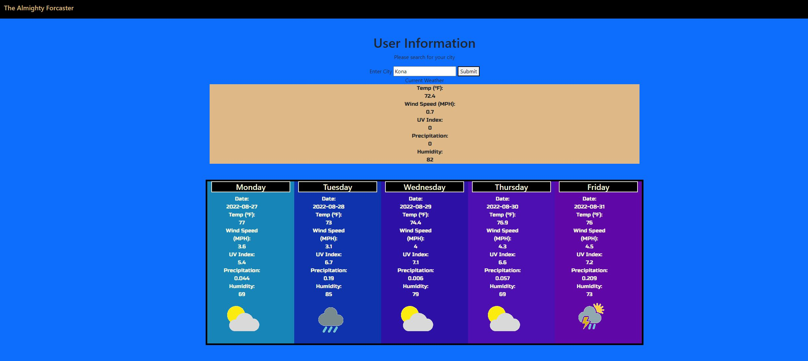

# Forcasting-the-Weather

## Description

---

This page allows users to search for a city and find the weather in that city for 5 days.
The user will be able to see 5 days of forecasts.

## User Story

As a traveler
I want to see the weather outlook for multiple cities
so that I can plan a trip accordingly

---

## Instalation

The insallation is straightforward. Just open the link in your browser and type the desired city :)

---

## Usage

---

When the page loads it will be blank.
Enter the desired 'City" into the search bar.
Click on the Submit button.
Viola! You can see the current forecast followed by the next 5 days.

## Screenshot

---

---

## Deployed Link

[My Deployed Page](https://madrodgerflynn.github.io/Forcasting-the-Weather/)
